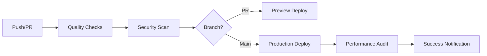

# Vercel & GitHub Integration Guide for LayoverHQ

## 🚀 Quick Setup

### Prerequisites
- Vercel account (https://vercel.com)
- GitHub repository access
- Admin permissions on the repository

## 📋 Step-by-Step Integration

### 1. Get Vercel Credentials

#### A. Vercel Token
1. Go to https://vercel.com/account/tokens
2. Click "Create Token"
3. Name it: `LayoverHQ-GitHub-Actions`
4. Select scope: "Full Account"
5. Copy the token (you won't see it again!)

#### B. Organization ID
1. Go to https://vercel.com/dashboard
2. Click on your team/organization name (top left)
3. Go to Settings → General
4. Copy the "Team ID" (this is your ORG_ID)

#### C. Project ID
1. Go to your LayoverHQ project in Vercel
2. Click on "Settings" tab
3. Copy the "Project ID" from the General section

### 2. Connect GitHub to Vercel

#### Option A: Via Vercel Dashboard (Recommended)
1. Go to https://vercel.com/dashboard
2. Click "Add New..." → "Project"
3. Import your GitHub repository
4. Configure build settings:
   ```
   Framework Preset: Next.js
   Root Directory: ./
   Build Command: npm run build
   Output Directory: .next
   Install Command: npm install
   ```
5. Add environment variables from your `.env` file

#### Option B: Via CLI
```bash
# Install Vercel CLI
npm i -g vercel

# Login to Vercel
vercel login

# Link project
vercel link

# Deploy
vercel --prod
```

### 3. Configure GitHub Secrets

#### Manual Method:
1. Go to your repository on GitHub
2. Navigate to Settings → Secrets and variables → Actions
3. Add these repository secrets:
   - `VERCEL_TOKEN`: Your token from step 1A
   - `VERCEL_ORG_ID`: Your org ID from step 1B
   - `VERCEL_PROJECT_ID`: Your project ID from step 1C

#### Automated Method:
```bash
# Run our setup script
./scripts/setup-github-actions.sh
```

### 4. Environment Variables

Ensure these are set in Vercel (Project Settings → Environment Variables):

```env
# Database
DATABASE_URL=your_database_url
POSTGRES_URL_NON_POOLING=your_postgres_url

# Supabase
NEXT_PUBLIC_SUPABASE_URL=your_supabase_url
NEXT_PUBLIC_SUPABASE_ANON_KEY=your_anon_key
SUPABASE_SERVICE_ROLE_KEY=your_service_key

# APIs
VIATOR_API_KEY=your_viator_key
AMADEUS_CLIENT_ID=your_amadeus_id
AMADEUS_CLIENT_SECRET=your_amadeus_secret
DUFFEL_API_TOKEN=your_duffel_token
STRIPE_SECRET_KEY=your_stripe_secret
NEXT_PUBLIC_STRIPE_PUBLISHABLE_KEY=your_stripe_public

# Google Maps
NEXT_PUBLIC_GOOGLE_MAPS_API_KEY=your_maps_key

# Redis (if using)
REDIS_URL=your_redis_url
```

### 5. Test the Integration

#### Create a Test PR:
```bash
# Create a test branch
git checkout -b test/ci-pipeline

# Make a small change
echo "// CI Test" >> lib/test.ts

# Commit and push
git add .
git commit -m "test: CI pipeline verification"
git push origin test/ci-pipeline

# Create PR via CLI
gh pr create --title "Test CI Pipeline" --body "Testing GitHub Actions integration"
```

#### What to Expect:
1. **On PR Creation:**
   - Code quality checks run
   - ESLint and TypeScript checks
   - Preview deployment to Vercel
   - Comment with preview URL

2. **On Merge to Main:**
   - Production deployment
   - Security scanning
   - Performance audit
   - Lighthouse reports

### 6. Monitoring

#### GitHub Actions:
- View runs: https://github.com/layoverHQ/layoverhq-v5/actions
- Check workflow status
- Download artifacts and logs

#### Vercel Dashboard:
- View deployments: https://vercel.com/dashboard
- Check build logs
- Monitor performance metrics
- View function logs

## 🔧 Troubleshooting

### Common Issues:

#### 1. "Workflow not authorized"
```bash
# Add workflow scope to GitHub token
gh auth refresh -h github.com -s workflow
```

#### 2. "Vercel deployment failed"
- Check environment variables in Vercel
- Verify build command: `npm run build`
- Check Node.js version (should be 18.x)

#### 3. "ESLint/TypeScript errors"
```bash
# Fix locally first
npm run lint:fix
npm run type-check
npm run build
```

#### 4. "Missing secrets"
```bash
# List current secrets
gh secret list

# Set missing secret
gh secret set SECRET_NAME
```

## 📊 CI/CD Pipeline Overview



## 🎯 Best Practices

1. **Always test locally first:**
   ```bash
   npm run check-all
   ```

2. **Use conventional commits:**
   ```
   feat: Add new feature
   fix: Fix bug
   docs: Update documentation
   style: Format code
   refactor: Refactor code
   test: Add tests
   chore: Update dependencies
   ```

3. **Keep secrets secure:**
   - Never commit `.env` files
   - Use GitHub Secrets for sensitive data
   - Rotate tokens regularly

4. **Monitor performance:**
   - Check Lighthouse scores
   - Review bundle size
   - Monitor Core Web Vitals

## 📚 Resources

- [Vercel Documentation](https://vercel.com/docs)
- [GitHub Actions Docs](https://docs.github.com/en/actions)
- [Next.js Deployment](https://nextjs.org/docs/deployment)
- [LayoverHQ Support](https://github.com/layoverHQ/layoverhq-v5/issues)

## ✅ Checklist

- [ ] Vercel account created
- [ ] GitHub repository connected
- [ ] Secrets configured
- [ ] Environment variables set
- [ ] Test PR created
- [ ] CI/CD pipeline verified
- [ ] Branch protection enabled
- [ ] Team access configured

---

**Need help?** Open an issue or contact the LayoverHQ team.